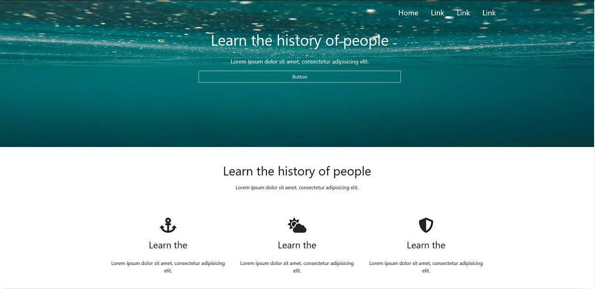

# PSD-Projets

## Table of contents
* [General info](#general-info)
* [Screenshots](#screenshots)
* [Technologies](#technologies)
* [Contact](#contact)

## General info
Zadanie wykonane w ramamch bootcampu Kodilla - "Web developer"
Strona typu "one page" wykonana na podstawie szablonu PSD.

## Screenshots

## Technologies

   * HTML 5
   * CSS 3
   * Bootstrap 
   * Sass
   * RWD
    
## Code Examples

	
				
## Contact
Created by me - feel free to contact me!
